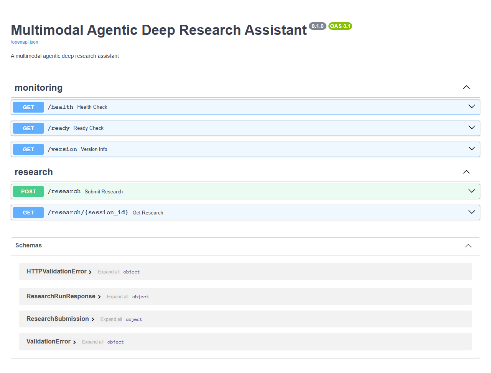
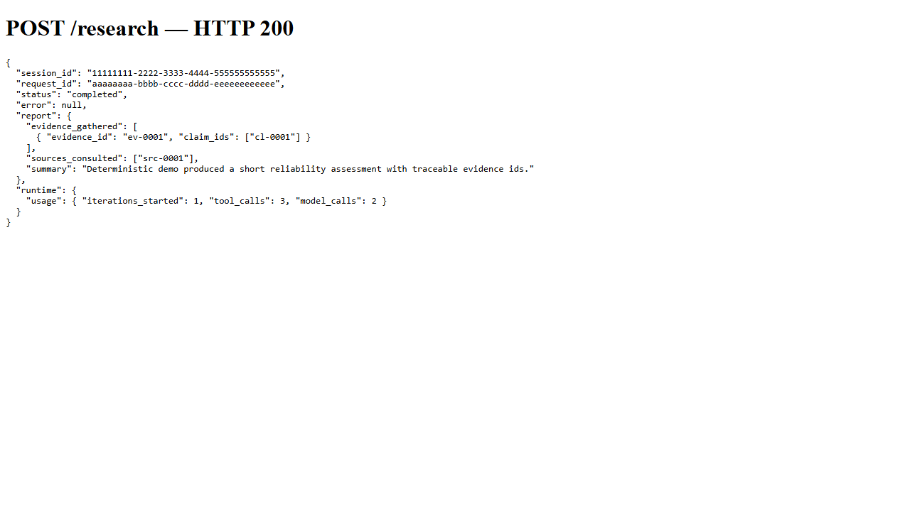
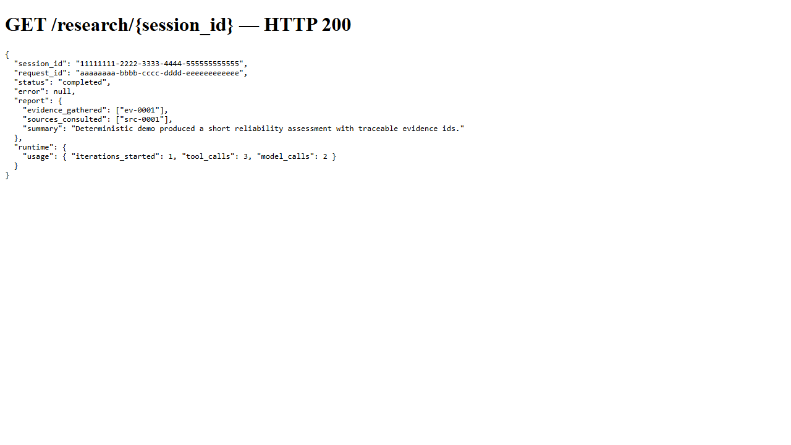

# Multimodal Agentic Deep Research Assistant

A provider-neutral Python research engine for bounded, evidence-oriented, multimodal research workflows.

## Quick Start

- **Prerequisites**: Python 3.12 and Git.
- **Clone & enter repo**:

```powershell
git clone https://github.com/LeelaissakAttota/multimodal-agentic-deep-research-assistant.git
cd multimodal-agentic-deep-research-assistant
```

- **Environment**: copy the example env and adjust if desired (the demo runs with defaults and needs no secrets):

```powershell
copy .env.example .env
```

- **Install dependencies (editable, test extras)**:

```powershell
python -m pip install -e ".[test]"
```

- **Run the offline demo** (deterministic, zero-network):

```powershell
madra-demo
```

- **Start the FastAPI app**:

```powershell
uvicorn deep_research.api.main:app --host 127.0.0.1 --port 8000
```

- **Open interactive API docs**: http://127.0.0.1:8000/docs (Swagger UI) or http://127.0.0.1:8000/redoc

- **Minimal research request (curl)**:

```powershell
curl -X POST "http://127.0.0.1:8000/research" -H "Content-Type: application/json" -d @examples/sample_request.json
```

- **Retrieve a session**:

```powershell
curl "http://127.0.0.1:8000/research/<SESSION_ID>"
```

- **Run tests**:

```powershell
pytest
```

## Project status

Phase 7 — Final Integration is complete. The frozen roadmap defines no Phase 8 scope; Phase 8 has not started.

The release includes:

- Dependency-injected planning, research, analysis, evaluation, and reporting agents
- Deterministic tool selection for web and document research paths
- Explicit bounded research-state transitions, reflection, evidence-gap detection, and replanning
- Transactional SQLite session persistence, immutable evidence history, and session recovery
- Bounded deterministic memory retrieval and provenance-aware agent context construction
- Retries, timeouts, budgets, emergency stop, normalized failures, and ordered model fallback
- Sanitized runtime events and traceable runtime usage reports
- Bounded FastAPI submission and process-local result lookup
- Offline demo scenarios and end-to-end/adversarial integration validation
- Reproducible pytest, Ruff, strict MyPy, and GitHub Actions quality gates

## Install and validate

Python 3.12 is the primary supported development runtime.

```powershell
python -m pip install -e ".[test]"
pytest
ruff check .
mypy src
```

The mandatory validation suite uses deterministic adapters, makes no live network or paid-model calls, requires no credentials, and costs $0.

## Run the offline demo

After installation:

```powershell
madra-demo
```

Or run a custom bounded objective:

```powershell
python -m deep_research.demo --objective "Assess reliability considerations for grid-scale battery storage"
```

The demo emits JSON containing terminal state, evidence/source identifiers, report data, and runtime accounting. It is intentionally synthetic and must not be represented as live web research.

## Product API

Start the API:

```powershell
uvicorn deep_research.api.main:app --host 127.0.0.1 --port 8000
```

`POST /research` accepts an objective of at most 10,000 characters plus bounded primitive metadata. Secret-like metadata, null characters, unknown fields, oversized metadata, and non-finite numbers are rejected. `GET /research/{session_id}` returns the process-local terminal result.

The default API performs deterministic zero-network research and retains at most 100 insertion-ordered sessions. Durable or multi-worker deployments must compose the existing `ResearchSessionRepository` and `ResearchContextBuilder` boundaries.

## Demo Preview

### Swagger API Interface


The Swagger UI shows the live OpenAPI specification and available endpoints (`/health`, `/ready`, `/version`, `/research`).

### Research Submission


Example successful `POST /research` response (HTTP 200) from the deterministic offline demo, showing `session_id`, `request_id`, `status`, `report`, and `runtime` usage.

### Research Result Retrieval


Use `GET /research/{session_id}` to fetch the terminal run result; the example demonstrates retrieving the same `ResearchRunResponse` returned by the submission.

## Architecture

The principal data and execution flows are:

```text
Durable Memory → Research State → ContextBuilder → Bounded AgentContext → Agent

Orchestrator → ExecutionHarness → Agent abstraction → Provider/tool abstraction

Claim → Evidence → Source
```

Research iterations, tool retries, model fallback attempts, and recovery attempts remain separate finite mechanisms. Provider SDKs and SQLite never enter agent/domain logic directly.

See `ARCHITECTURE.md`, `DECISIONS.md`, and `PROJECT_RULES.md` for the frozen boundaries.

## Multimodal status

The modality taxonomy is `TEXT`, `WEB`, `DOCUMENT`, `PDF`, `IMAGE`, `VIDEO`, `AUDIO`, `ACADEMIC`, `SOCIAL`, and `STRUCTURED_DATA`.

- Deterministic/tested: web search and document-reader tool paths, typed modality registry/selection, evidence/source identifier propagation
- Infrastructure-compatible but not live verified: PDF, image, video, audio, academic, social, and structured-data provider adapters
- Not implemented: live provider SDK integrations, multimedia transcription/vision pipelines, and a graphical UI

No modality is claimed live without a real provider integration and live acceptance test.

## Runtime defaults

`MADRA_` environment variables configure the Phase 6 harness. Defaults are 3 research iterations; 20/60 tool calls per iteration/session; 15/45 model calls per iteration/session; 4,000/50,000 measurable tokens per call/session; 300 seconds per session; 30 seconds per tool call; 60 seconds per model call; 10 paid external API calls; and 2 retries per tool or model operation. `MADRA_EMERGENCY_STOP=true` fails closed before the next bounded operation.

Retries consume call budgets but not research iterations. Unknown/permanent failures are not retried, and ordered model fallback occurs only after transient connection or timeout exhaustion.

## Repository map

- `src/deep_research/` — application source and offline demo entry point
- `tests/unit/` — domain, agent, runtime, API, persistence, and regression tests
- `tests/integration/` — Phase 7 full-stack and adversarial validation
- `.github/workflows/quality.yml` — GitHub quality gate
- `docs/architecture/` — frozen architecture asset
- Root Markdown files — authoritative policies, roadmap, decisions, audits, and release documentation

## Security and limitations

Never commit `.env`, credentials, runtime databases, generated research, logs, caches, or bytecode. See `SECURITY.md` and `SECURITY_GUIDELINES.md`.

Known limitations include process-local API lookup, synchronous local SQLite, lexical rather than embedding retrieval, tokenizer-independent character bounds, cancellation-dependent async timeouts, and no automatic continuation of a partially completed recovered iteration. The release does not estimate monetary provider cost because no authoritative pricing catalog is defined.

## License

MIT — see `LICENSE`.
